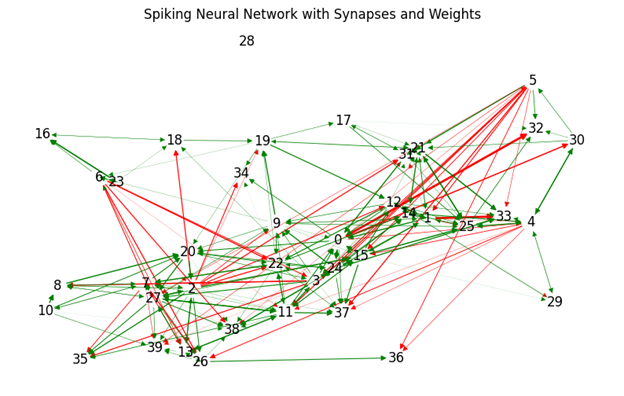
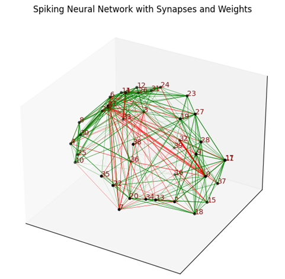
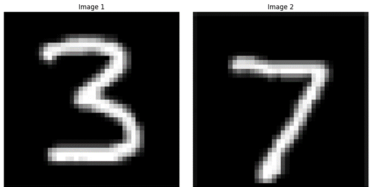
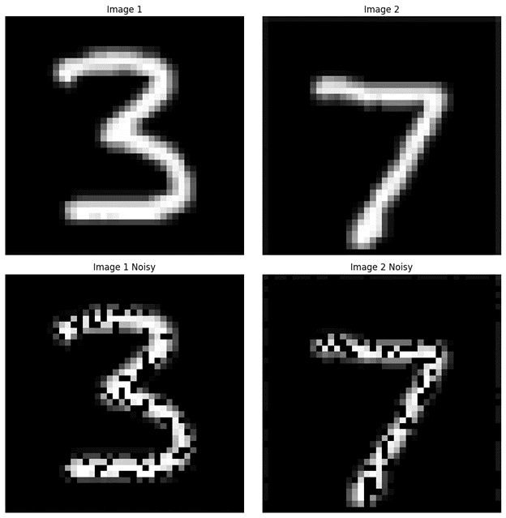

# Pattern Recognition in 2D/3D Spiking Neuron Cultures Using STDP

## Overview

This project explores the capabilities of a 2D spiking neuron culture in performing pattern recognition tasks using the Leaky Integrate-and-Fire (LIF) model and Spike-Timing-Dependent Plasticity (STDP). The project extends to a 3D spiking neuron culture, drawing parallels with brain organoids and their implications for neuroscience research.

## Objectives

- Model a network of excitatory and inhibitory neurons arranged in a 2D grid.
- Implement distance-based synaptic connectivity and apply the LIF neuron model.
- Preprocess input patterns into spike times and train the network using STDP.
- Analyze the network's ability to distinguish between different visual patterns through synaptic weight changes and spiking activity.
- Extend the study to a 3D neuron culture to simulate more complex brain-like structures.

## Network Design

### 2D Neuron Culture

The 2D neuron culture consists of 8 excitatory and 2 inhibitory neurons, randomly placed in a 2D space. Connectivity between neurons is determined by a probability function based on their distance. The closer two neurons are, the more likely they are to form a synaptic connection.

### 3D Neuron Culture

To approximate the complex structure of a brain organoid, neurons are positioned on the surface of a sphere. This 3D arrangement mimics a more biologically realistic neural network structure.

## Methods

### Spiking Neural Networks (SNNs)

SNNs mimic the natural processes in the brain by using neurons that communicate via spikes. In this project, the LIF model is employed, where neurons integrate incoming spikes and fire when a threshold is reached.

### Spike-Timing-Dependent Plasticity (STDP)

STDP adjusts the strength of synapses based on the timing of spikes from pre-synaptic and post-synaptic neurons. This mechanism is crucial for the network's learning process.

### Input Processing

The MNIST dataset is used for input patterns, specifically the digits "3" and "7." Images are preprocessed, resized to a 10x10 grid, and then converted into spike times that the neurons process.

## Training and Pattern Recognition

### Initial Simulation

The network is trained over 700 ms, where input patterns are introduced, and neuron responses are monitored. Synaptic weights are adjusted according to the STDP rules.

### Extended Simulation with Delayed Inputs

The simulation is extended to 1400 ms to assess the network's response to delayed inputs. The network undergoes multiple learning phases, and its ability to recognize patterns over time is analyzed.

### Noisy Input Patterns

To test the robustness of the network, noisy versions of the input patterns are introduced. The network's ability to recognize patterns despite the noise is evaluated.

## Results

### Synaptic Weight Evolution

Synaptic weights evolve as the network learns to recognize patterns. The weights reflect the network's learning process and its ability to stabilize after repeated pattern presentations.

### Neuron Spiking Activity

Neuron spiking activity is recorded, showing how neurons respond to different input patterns. The spiking patterns reveal the network's learning and memory capabilities.

## 3D Neuron Culture and Brain Organoids

The project extends to a 3D neuron culture, simulating brain organoids. This model offers insights into how neural networks function in a more complex, three-dimensional structure.

## Implications for Brain Organoids

Brain organoids are three-dimensional cellular structures that mimic aspects of human brain architecture and function. This project draws parallels between simplified 2D/3D neuron cultures and brain organoids, offering insights into neural development, disease modeling, and neurogenesis.

## Conclusion

This project demonstrates that even a simplified 2D spiking neuron culture can perform complex computational tasks like pattern recognition. Extending the model to 3D neuron cultures enhances our understanding of neural dynamics and offers a valuable tool for studying brain-like structures and their potential applications in neuroscience.

## References

1. [PMC Article on Brain Organoids](https://www.ncbi.nlm.nih.gov/pmc/articles/PMC10420018/)
2. [Nature Article on SNNs](https://www.nature.com/articles/s42003-023-04511-z)
3. [Brian2 Documentation](https://brian2.readthedocs.io/en/stable/)
4. [Journal Article on Brain Organoids](https://journals.biologists.com/dev/article/146/8/dev166074/19861/Brain-organoids-advances-applications-and)

---

### Note:
- Replace `"images/*"` with the actual paths to your image files in the repository.
- Ensure all images used are saved in the repository under the appropriate directory (e.g., `images/`).

